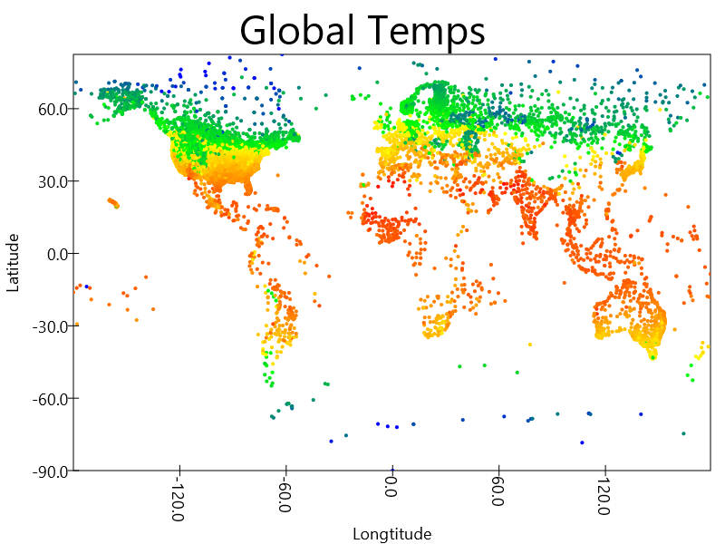

### What is this project?

###### Some examples in learnspark is from MarkLewis's online tutorial and the playground and swiftvis2 packages are from Mark Lewis's repo at https://github.com/MarkCLewis/SwiftVis2
###### Since I did not make the swiftvis2 into jar, using sbt to run the scripts will cause error but import the project into eclipse and run in eclipse will solve the problem

